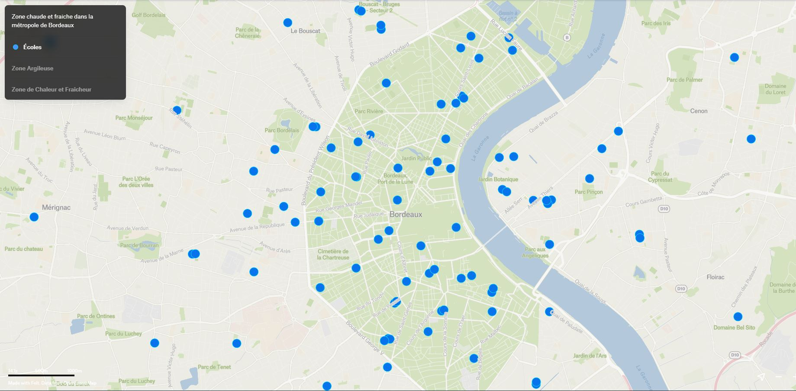
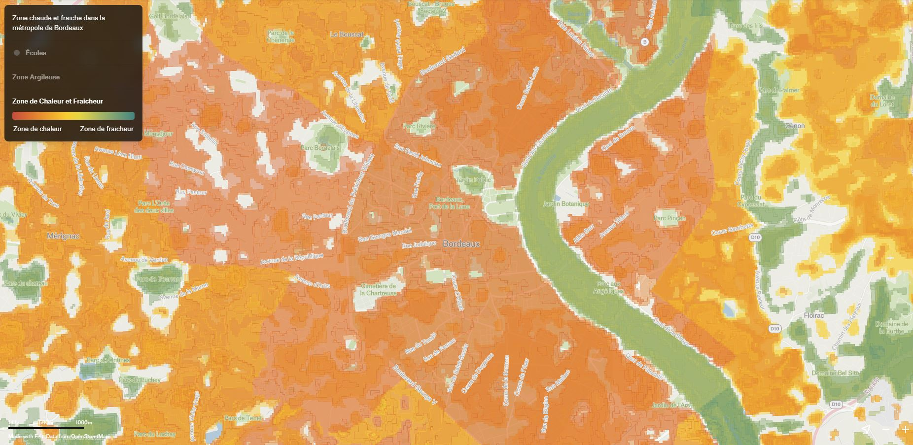
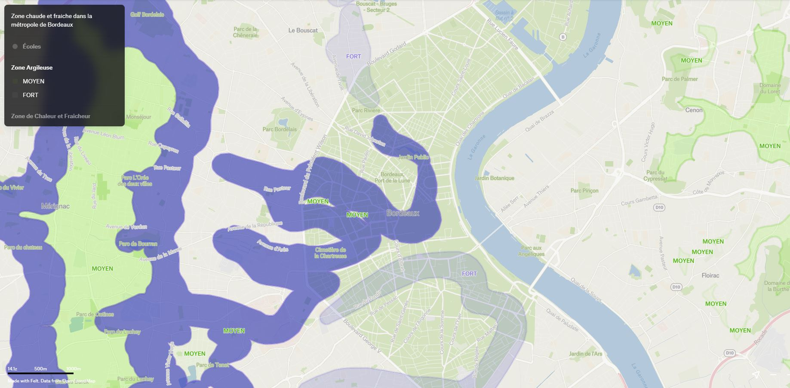
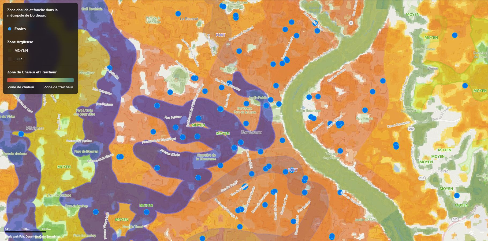

# Projet Sentinelle - HACKATHON 2026

## Description:

Sentinelle est une application de prévention des risques liés aux fortes chaleurs, dédiée aux établissements scolaires de la métropole bordelaise.

Elle permet d’identifier le niveau d’exposition à la chaleur de chaque école (zone chaude, modérée ou îlot de fraîcheur) à partir de données environnementales et urbaines.

L’objectif est double :

* Informer les citoyens, les parents et les équipes éducatives sur les conditions thermiques de leur établissement ;

* Proposer des recommandations adaptées pour protéger la santé des élèves lors des épisodes de canicule.

Sentinelle s’inscrit également dans une démarche de résilience territoriale. L’application met en évidence les zones prioritaires où des actions de végétalisation qui peuvent être mises en place afin de réduire les îlots de chaleur, tout en prenant en compte les contraintes liées aux sols argileux et aux risques de fissuration.

Ainsi, Sentinelle ne se limite pas à l’observation des risques : elle contribue à orienter les décisions d’aménagement pour améliorer durablement le confort thermique et la sécurité des infrastructures scolaires.

## Utilisateurs et usages:

Le projet Sentinelle s’adresse à plusieurs catégories d’utilisateurs :

* Citoyens (parents, habitants) : consulter le niveau d’exposition à la chaleur des établissements scolaires et adapter leurs comportements en période de canicule ;
* Acteurs publics (collectivités territoriales, établissements scolaires) : anticiper les risques, protéger les élèves et planifier des actions d’aménagement, notamment en matière de végétalisation.

Cette organisation permet de regrouper les acteurs impliqués dans la gestion et l’adaptation du territoire face aux risques climatiques.

L’application fournit ainsi des informations adaptées à chaque type d’utilisateur afin de faciliter la compréhension des risques et la prise de décision.

## Perspectives:
- Intégration d’autres risques (inondations, incendies)
- Ajout de données en temps réel (température, alertes météo)
- Développement d’une application mobile (en attendant que le site sois terminé)


## Cartographie:

### Description:
La cartographie permet d’identifier rapidement le niveau d’exposition à la chaleur des établissements scolaires de la métropole bordelaise.

Chaque école est située sur une carte et associée à un indicateur visuel (baromètre thermique) allant :

* Du rouge pour les zones les plus chaudes (forte exposition aux îlots de chaleur),

* Au vert pour les zones les plus fraîches (présence de végétation ou d’ombre).

Cette visualisation permet de repérer immédiatement les zones à risque et d’orienter les actions prioritaires, notamment en matière de végétalisation et d’aménagement urbain.

La cartographie a été réalisée à l’aide de l’outil Felt (https://felt.com), permettant de visualiser et superposer différentes couches de données géographiques.

Felt a permis de croiser différentes couches de données (îlots de chaleur, établissements scolaires) afin de produire une visualisation claire et interactive.

Lien du site de la carte: https://felt.com/map/Untitled-Map-trd59Cqj4RuKu8WX9Cw2eYCD?loc=44.902,-0.6695,11.06z


### Données des écoles de la métropole de Boredaux:


### Données des îlos de chaleur et de fraicheur de la métropole de Boredaux:


### Données de la zone argileuse de la métropole de Boredaux:


### Superposition de toutes les données:



## Données utilisées:

- Données d'îlot de chaleur ou de fraicheur urbain basé sur l'analyse des températures de surface de 2022 - source : Datahub Métropole de Bordeaux.

- Données sur les établissements scolaires - Overpass Turbo (OpenStreetMap).

## Fonctionnalités:

- Visualisation des îlots de chaleur autour des écoles.

- Identification des zones à risque (chaud / modéré / frais).

- Recommandations adaptées en cas de canicule.

- Aide à la décision pour la végétalisation urbaine.

## Structure du projet
### Structure back-end:

```bash
sentinelle-backend/
│
├── README.md
├── images/
│   ├── Sentinelle_ecole.JPG
│   ├── Sentinelle_chaleur_fraicheur.JPG
│   ├── Sentinelle_argile.JPG
│   └── Sentinelle.JPG
│
├── data/
│   ├── export.geojson
│   ├── lcz_bordeaux.geojson
│   └── ri_alearga_s.geojson
│
├── .gitattributes
│
├── main.py
├── analysis.py
├── database.py
├── models.py
│
├── requirements.txt
│   
├── test_S_final.py
├── test_ecoles.py
├── test_ecoles.sh
└── test_sentinelle.py

```

## Logique de calcul et analyse

Le projet Sentinelle repose sur une analyse croisée de plusieurs indicateurs environnementaux :

* **Végétation (ver)** : présence de végétation favorisant la fraîcheur
* **Surface imperméable (bur)** : contribution à l’îlot de chaleur
* **Chaleur résiduelle (vhr)** : stockage de chaleur dans les matériaux urbains

Un score thermique est calculé pour chaque zone :

* Plus le score est élevé, plus la zone est exposée à la chaleur
* Le score est ensuite classé en trois niveaux :

  * **ROUGE** : forte exposition
  * **ORANGE** : exposition modérée
  * **VERT** : zone de fraîcheur

Cette approche permet de simplifier des données complexes en un indicateur lisible pour les utilisateurs.

## Analyse du risque argile

Le projet intègre également le phénomène de retrait-gonflement des argiles.

À partir de données géographiques (GeoJSON), chaque établissement scolaire est analysé afin de déterminer son niveau d’exposition au risque :

* Faible ou nul
* Moyen
* Fort

Cette analyse repose sur l’intersection entre les coordonnées GPS des écoles et les zones d’aléa argileux.

Elle permet d’éviter des solutions inadaptées, notamment en matière de végétalisation, qui pourraient aggraver les risques de fissuration des bâtiments.

## Système de recommandations

Sentinelle propose un système de recommandations basé sur le niveau de risque thermique.

Trois niveaux sont définis :

* **ROUGE (urgence)** : actions immédiates de rafraîchissement et d’adaptation
* **ORANGE (vigilance)** : amélioration progressive des conditions
* **VERT (préservation)** : maintien et transmission des bonnes pratiques

Les recommandations sont organisées selon quatre axes :

* **Infrastructures** : aménagements urbains et végétalisation
* **Écoles** : organisation et pratiques éducatives
* **Familles** : comportements et prévention sanitaire
* **Acteurs publics** : sensibilisation et actions collectives

Ce système permet de transformer l’analyse en actions concrètes adaptées à chaque situation.

## Chargement des données

Les données géographiques sont chargées dynamiquement à partir de fichiers GeoJSON stockés localement dans le dossier `data/`.

Le système utilise la bibliothèque GeoPandas pour lire et manipuler les données spatiales :

* `export.geojson` : contient les établissements scolaires
* `lcz_bordeaux.geojson` : contient les zones climatiques urbaines (îlots de chaleur et de fraîcheur)

Le chargement des données repose sur :

* une détection automatique du chemin du projet
* une vérification de l’existence des fichiers
* une gestion des erreurs en cas de problème de lecture

Cette approche garantit une bonne robustesse du système et facilite le déploiement du projet sur différents environnements.

## Architecture de l’API

Le backend de Sentinelle repose sur une API développée avec FastAPI.

L’application suit une architecture modulaire :

* `main.py` : point d’entrée de l’API et gestion des routes
* `database.py` : chargement des données géographiques
* `analysis.py` : calcul des scores et génération des recommandations
* `models.py` : définition des modèles de données (Pydantic)

L’API permet de transformer des données géographiques complexes en diagnostics accessibles aux utilisateurs.

## Endpoints API

### Accueil

* `GET /`

  * Vérifie que l’API est en ligne
  * Oriente l’utilisateur selon son profil

---

### Diagnostic d’un établissement

* `GET /diagnostic/recherche/{ecole_name}?categorie=public|pro`

Permet d’obtenir un diagnostic complet pour un établissement scolaire :

* score thermique
* niveau d’alerte (baromètre)
* recommandations personnalisées
* risque argile

Les recommandations sont filtrées selon le profil utilisateur :

* **public** : familles, citoyens
* **pro** : collectivités, services techniques

---

### Simulation

* `GET /diagnostic/simulation/{ecole_name}?projet_veg=30`

Simule l’impact d’un projet de végétalisation :

* surface traitée
* coût estimé
* économies potentielles
* rentabilité sur 20 ans

Permet d’aider à la prise de décision pour les acteurs publics.

## Gestion des profils utilisateurs

Le projet intègre une logique d’adaptation des résultats en fonction du profil utilisateur :

* **Public** : familles, parents, citoyens
* **Professionnel** : collectivités, élus, services techniques

Les recommandations sont filtrées dynamiquement afin de proposer des informations pertinentes selon les besoins :

* santé et prévention pour le public
* aménagement et infrastructure pour les professionnels

Cette approche améliore la lisibilité et l’efficacité des actions proposées.

## Analyse spatiale

Le projet repose sur des traitements géographiques avancés :

* intersection entre établissements scolaires et zones climatiques
* analyse du risque argile à partir de buffers de 50 mètres
* utilisation de GeoPandas pour manipuler les données spatiales

Ces analyses permettent d’identifier précisément les risques environnementaux à l’échelle locale.

## Simulation et aide à la décision

Sentinelle intègre un simulateur permettant d’évaluer l’impact d’un projet de végétalisation :

* estimation des coûts d’aménagement
* calcul des gains liés à la prévention des risques (notamment argile)
* bilan économique à long terme

Cet outil permet de transformer les données en un véritable outil d’aide à la décision pour les collectivités.

## Modèle de données

Le projet utilise des modèles de données définis avec Pydantic afin de structurer les réponses de l’API.

### Diagnostic

Le modèle principal utilisé est le modèle `Diagnostic`, qui représente le résultat d’une analyse pour un établissement scolaire :

* **nom** : nom de l’établissement
* **score_alerte** : score thermique calculé (0 à 100)
* **barometre** : niveau d’alerte (VERT, ORANGE, ROUGE)
* **recommandation** : recommandations adaptées selon le profil utilisateur
* **alea_argile** : niveau de risque lié aux sols argileux

Ce modèle garantit la cohérence des données renvoyées par l’API et facilite leur exploitation côté frontend.

## Installation

### Prérequis

* Python 3.10 ou supérieur
* pip

### Installation des dépendances

```bash
pip install -r requirements.txt
```

Les principales bibliothèques utilisées sont :

* **FastAPI** : création de l’API backend
* **Pydantic** : validation et structuration des données
* **Uvicorn** : serveur ASGI pour exécuter l’application
* **Pandas** : manipulation de données
* **GeoPandas** : traitement des données géographiques
* **Shapely** : analyse spatiale (intersections, buffers)
* **Unidecode** : normalisation des chaînes de caractères
* **Requests** : appels HTTP


## Auteurs:
Équipe:
* Luidgi Watson: https://github.com/Luidgiwtsn
* Ryan Tipveau: https://github.com/Melopheelo12
* Pawnee Defize: https://github.com/Pawnee33
