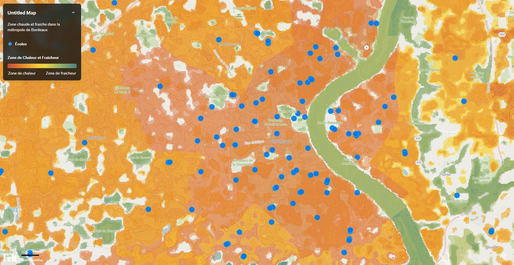

# Projet Sentinelle - HACKATHON 2026

## Description:

Sentinelle est une application de prévention des risques liés aux fortes chaleurs, dédiée aux établissements scolaires de la métropole bordelaise.

Elle permet d’identifier le niveau d’exposition à la chaleur de chaque école (zone chaude, modérée ou îlot de fraîcheur) à partir de données environnementales et urbaines.

L’objectif est double :

informer les citoyens, les parents et les équipes éducatives sur les conditions thermiques de leur établissement ;
proposer des recommandations adaptées pour protéger la santé des élèves lors des épisodes de canicule.

Sentinelle s’inscrit également dans une démarche de résilience territoriale. L’application met en évidence les zones prioritaires où des actions de végétalisation qui peuvent être mises en place afin de réduire les îlots de chaleur, tout en prenant en compte les contraintes liées aux sols argileux et aux risques de fissuration.

Ainsi, Sentinelle ne se limite pas à l’observation des risques : elle contribue à orienter les décisions d’aménagement pour améliorer durablement le confort thermique et la sécurité des infrastructures scolaires.

## Cartographie:

